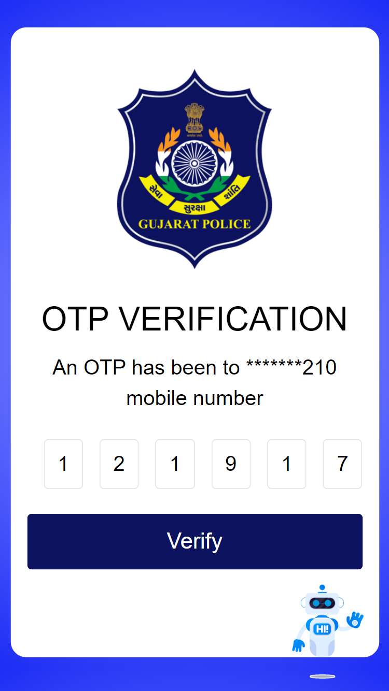

# Granthi

Granthi is a Django based Webapp for feedback management of Police Stations. <br>
This is basically an enhanced version of '[Mantavya](https://github.com/Nisheet-Patel/Mantavya)' project which we created 
during SSIP Hackation - 2022.

### How this differs from original?

✅ OTP Verification (Using Twilio API) <br>
✅ Updated Design <br>
✅ Clean Code Base <br>
✅ Basic Chatbot <br>
✅ Password Changes for user <br>

## *Preview*

#### Phone




  <br>

#### Admin Side


## *Installation*

Use the package manager [pip](https://pip.pypa.io/en/stable/) to install requirements.

## To Run Locally

### 1. Create Virtual Environment (Optional)
```python
python -m venv env_name
```

### 2. Install All Requirements
```python
pip install -r requirements.txt
```

### 3. Set Custom Database (Optional) [Granthi/settings.py](Granthi/settings.py)

## We are using sqlite

```
DATABASES = {
    'default': {
        'ENGINE': 'django.db.backends.sqlite3',
        'NAME': BASE_DIR / "db.sqlite3",
    }
}
```
### 4. Set Envirnoment Variables [Granthi/settings.py](Granthi/settings.py)

```
DEV_ENV (True/False)
SECRET_KEY
account_sid (For Twilio API | Optional)
auth_token (For Twilio API | Optional)
messaging_service_sid (For Twilio API | Optional)
SESSION_EXPIRY
```

### 5. Create Database

```python
python manage.py makemigrations
```

```python
python manage.py migrate
```

### 6. Collect Static Files

```
python manage.py collectstatic
```

### 6. Run Server
```python
python manage.py runserver
```

### ⚠️ Default password for all user is: 12345678